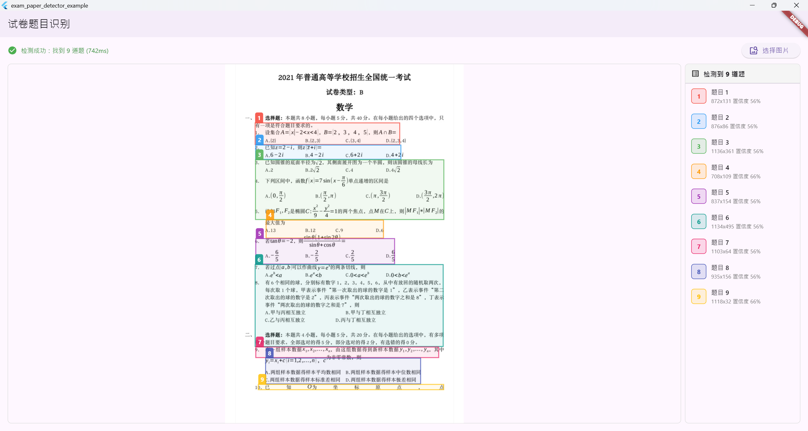

# 试卷题目识别与框选系统

基于 Flutter + Rust + flutter_rust_bridge 的跨平台试卷题目自动识别系统。

# 使用示例图



## 架构特点

- **Flutter Plugin**: 标准 Flutter 插件架构
- **flutter_rust_bridge**: 自动生成类型安全的 Rust-Dart 绑定
- **核心算法全在 Rust**: 图像处理、版面分析、题目分割
- **跨平台**: Android、iOS、Windows、macOS、Linux

## 项目结构

```
exam_paper_detector/
├── lib/                    # Dart 代码
├── rust/                   # Rust 核心代码
│   ├── src/
│   │   ├── paddle_ffi.rs   # Paddle Inference C API FFI 绑定
│   │   ├── ocr_paddle.rs   # PaddleOCR 引擎 (det + rec)
│   │   ├── ocr.rs          # OCR 适配层 (trait + adapter)
│   │   ├── layout_detector.rs # DocLayout-YOLO 版面分析
│   │   └── ...             # 其他模块
│   ├── paddle_inference/   # Paddle Inference C 推理库 (需下载)
│   ├── models/             # 模型文件 (需下载)
│   │   ├── det/rec/        # PaddleOCR 模型
│   │   └── layout/         # DocLayout-YOLO ONNX 模型
│   └── Cargo.toml
├── scripts/                # 工具脚本
│   ├── download_paddle_inference.py  # 下载 Paddle Inference C 库
│   ├── download_models.py            # 下载 PaddleOCR 模型
│   └── download_layout_model.py      # 下载 DocLayout-YOLO ONNX 模型
├── example/                # 示例 App
├── android/                # Android 平台
├── ios/                    # iOS 平台
├── windows/                # Windows 平台
├── macos/                  # macOS 平台
└── linux/                  # Linux 平台
```

## 快速开始

### 环境要求

- Flutter SDK >= 3.0.0
- Rust >= 1.70.0
- Python 3 (用于运行下载脚本)
- flutter_rust_bridge_codegen

### 1. 安装工具链

```bash
cargo install flutter_rust_bridge_codegen
```

### 2. 下载 Paddle Inference C 推理库

自动检测平台并下载预编译库到 `rust/paddle_inference/`：

```bash
python scripts/download_paddle_inference.py
```

支持平台：Windows x64、Linux x64、macOS x64/ARM64。
也可手动指定：`--platform linux-x64`、`--platform macos-arm64` 等。

### 3. 下载 PaddleOCR 模型

下载 PP-OCRv4 原生 Paddle 格式模型到 `rust/models/`：

```bash
python scripts/download_models.py
```

默认下载 mobile 版本（体积小、速度快）。下载 server 版本（精度高）：
```bash
python scripts/download_models.py --variant server
```

### 4. 下载 DocLayout-YOLO 版面分析模型（可选）

下载 DocLayout-YOLO ONNX 模型到 `rust/models/layout/`（~72MB）：

```bash
python scripts/download_layout_model.py
```

### 5. 构建

```bash
# 生成 Rust-Dart 绑定代码
flutter_rust_bridge_codegen generate

# 运行示例
cd example
flutter run
```

> **运行时注意**：确保 Paddle Inference 动态库在系统 PATH 中：
> - Windows: `set PATH=rust\paddle_inference\paddle\lib;%PATH%`
> - Linux: `export LD_LIBRARY_PATH="rust/paddle_inference/paddle/lib:$LD_LIBRARY_PATH"`
> - macOS: `export DYLD_LIBRARY_PATH="rust/paddle_inference/paddle/lib:$DYLD_LIBRARY_PATH"`

## 开发流程

1. 在 `rust/src/api.rs` 中定义 Rust API
2. 运行 `flutter_rust_bridge_codegen generate` 生成绑定
3. 在 Dart 中调用生成的 API

## 功能特性

- ✅ 图像预处理（去噪、二值化、校正）
- ✅ 智能版面分析（DocLayout-YOLO AI 模型增强）
- ✅ 题号自动定位
- ✅ 题目区域分割
- ✅ 置信度评估
- ✅ Debug 可视化
- ✅ PaddleOCR 集成（Paddle Inference C API，支持中英文 OCR）
- ✅ DocLayout-YOLO 版面分析（标题/正文/图片/表格/公式 10 类检测）

## OCR 引擎

采用 **Paddle Inference C API** 方案集成 PaddleOCR：

- 通过 Rust FFI 调用 PaddlePaddle C++ 推理库
- 直接加载 Paddle 原生格式模型，无需 ONNX 转换
- 完整的 检测(DB) + 识别(CRNN) pipeline
- 支持 6000+ 中英文字符
- CPU 推理，无 GPU 依赖
- 无 Python 运行时依赖

## 版面分析

采用 **DocLayout-YOLO** (YOLOv10) 模型实现 AI 版面分析：

- 基于 ONNX Runtime 推理，自动下载运行时库
- 10 类版面元素检测：标题、正文、图片、表格、公式等
- 检测结果用于增强 TextBlock 的分类，提高题目分割精度
- 可选功能，不配置时自动跳过

配置示例：
```json
{
  "layout": {
    "model_path": "rust/models/layout/doclayout_yolo_docstructbench_imgsz1024.onnx",
    "confidence_threshold": 0.3,
    "input_size": 1024
  }
}
```

## License

MIT
